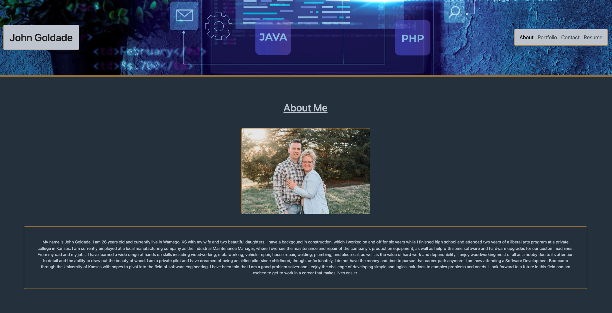
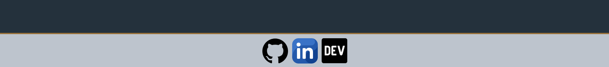
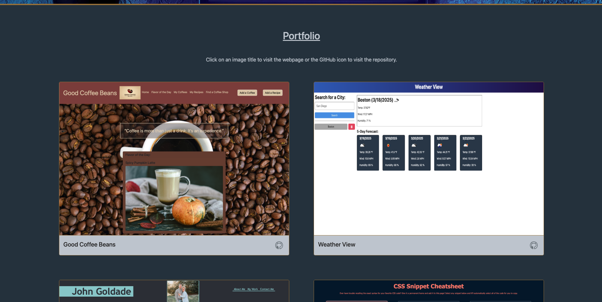
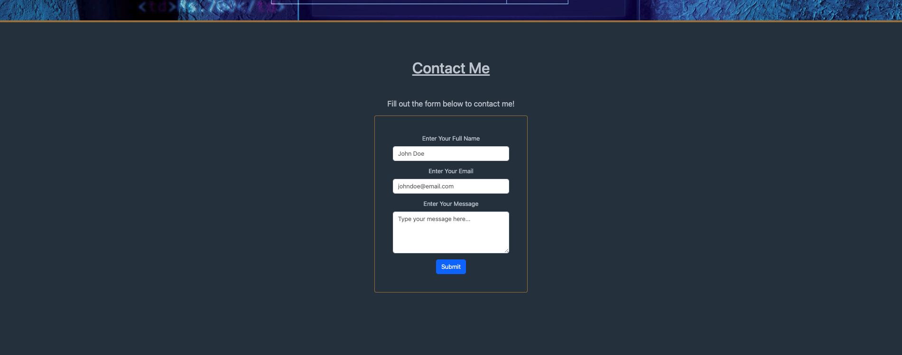
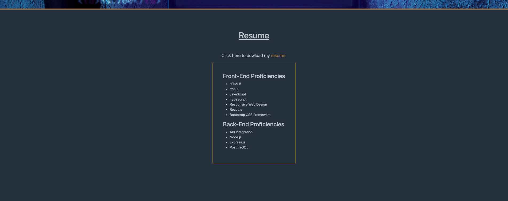

# John Goldade Portfolio

## Description

This is my portfolio built with React.js!

## Table of Contents

- [Installation](#installation)
- [Usage](#usage)
- [Credits](#credits)
- [License](#license)
- [Contributing](#contributing)
- [Tests](#tests)
- [Questions](#questions)

## Installation

To view the project, click this [link](https://johngoldadeportfolio.netlify.app/) to navigate to the webpage.

## Usage

Once you've successfully navigated to the webpage, feel free to poke around and see what you can learn about me and my work! 

To get you started, here is a quick tutorial on the features you'll find.

When the page loads, it will look like this ...

... where you can see an image of me and read a short bio.

On the footer, click on an icon to visit my profile for that site.

Navigating to the "Portfolio" page, you can view six of my deployed projects. Click on the title of the project to visit the deployed webpage or click on the GitHub icon to view the project repository.

Navigating to the "Contact" page, you can fill out a form to send me a message. The form requires all three fields to be filled out and verifies that the email address provided is valid before it will submit. If a discrepancy is found, it will display the appropriate alert.

Lastly, navigating to the "Resume" page, there is a prompt asking you to click on the golden "resume" text. Clicking on this link will automatically download my (currently very incomplete) resume. Listed below the link are the current skills I have built so far in my training as a Software Developer.

That's it for my portfolio built with React.js!

## Credits

- Link Icons were sourced from [Flaticon](https://www.flaticon.com/)...
    - The website tab icon was [created by koicon](https://www.flaticon.com/free-icons/work-experience).
    - The GitHub icon in the footer was [created by Dave Gandy](https://www.flaticon.com/free-icons/cat).
    - The LinkedIn icon in the footer was [created by Ruslan Babkin](https://www.flaticon.com/free-icons/linkedin).
    - The GitHub icon for the porfolio cards was [created by pocike](https://www.flaticon.com/free-icons/github).
- The DEV icon was saved from [the DEV Community website](https://dev.to/).

## License

Licensed under the [MIT](./LICENSE) license.

## Contributing

This project has no contribution guidelines.

## Tests

There are no test instructions developed for this project.

## Questions

- GitHub: [Johngoldade](https://github.com/Johngoldade)
- Email: [goldade.john@gmail.com](mailto:goldade.john@gmail.com)

To ask further questions, reach out to me at the above email and I will get back to you as soon as I can.
